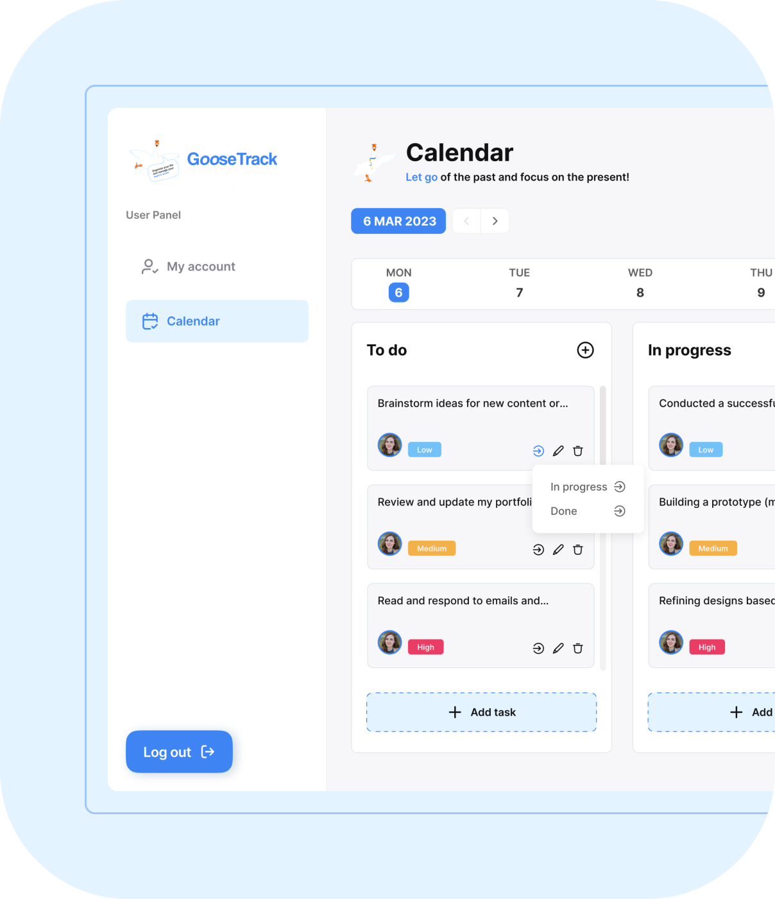

# Goose Track. Frontend project 

- It is the task manager with personal to-do list.
- The project implements the possibility of user authorization and authentication.
- Users can  edit user profile and add review.
- Assign tasks by completion status.
- View completion statistics over a period of time.
- Add, view, edit and delete tasks.
- Ability to display the tasks on the calendar.
- Task selection by date.

## All-in-One

GooseTrack is an all-in-one productivity tool that helps you stay on top 
of your tasks, events, and deadlines. Say goodbye to scattered to-do lists 
and hello to streamlined productivity with GooseTrack.

!

## Deploy

The frontend part of the web-app is deployed on gh-pages.

```javascript
"https://dimitri-y.github.io/GooseTrack-group-7/";
```

!### The technology stack used in the project:

<code></code>
<code></code>
<code></code>
<code></code>
<code></code>
<code></code>
<code></code>
<code></code>
<code></code>
<code></code>
<code></code>

## Developers:

1. [Dmytro Bondarenko](https://github.com/Dimitri-Y)
2. [Ludmila Kurochkina](https://github.com/ludmilka-k)
3. [Kateryna - Silchenko](https://github.com/Kateryna1706)
4. [Taras Mysiura](https://github.com/TarasMysiura)
5. [Serhii Prozhyvarov](https://github.com/prozhyvarov)
6. [Diana Smilian](https://github.com/diankasmilian)
7. [Katerina Nikitina](https://github.com/KaterynaNikitina)
8. [Denis Belousov](https://github.com/denis-bw)
9. [Vitalii Borysenko](https://github.com/Senriv)
10. [Alla Pohrebniak](https://github.com/9Alla9)
11. [Olexander Klymuk](https://github.com/swcAlexander)
12. [Max Gerasimenko](https://github.com/MaksoN03)